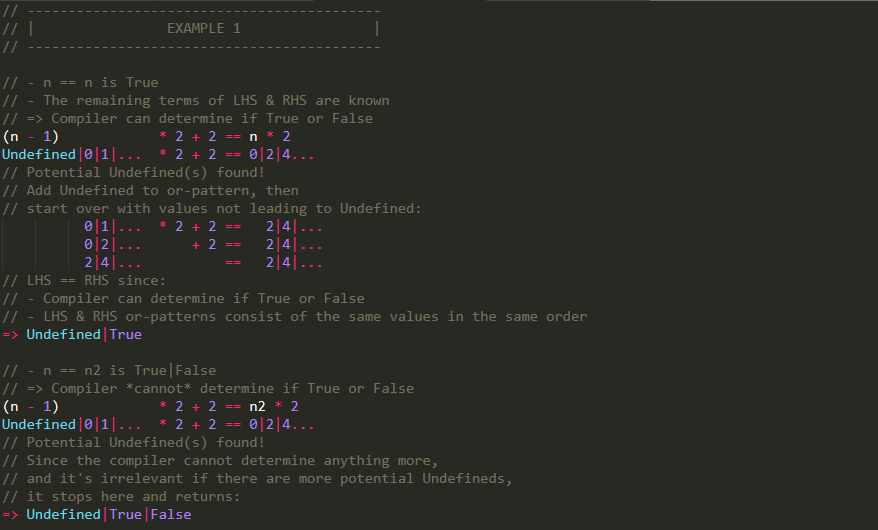

# P+ programming language
P+ is for...
* Performance
* Power
* Productivity

... and most importantly:
* **It makes sense.**

## Features
#### Definitions
<sup>Keywords surrounded by</sup>
* <sub>brackets (`[]`) are *optional*</sub>
* <sub>angle brackets (`<>`) **must** be replaced by a name of your choice</sub>
* <sub>backticks (`` ` ``) are **required** and escapes these definitions (i.e. `` a`|`b `` means you must literally type `a|b`)</sub>
* <sub>parentheses (`()`) **and** seperated by bars (`|`) are part of a list of mutually exclusive **required** keywords</sub>
* <sub>brackets (`[]`) **and** seperated by bars (`|`) are part of a list of mutually exclusive *optional* keywords</sub>

<sub>Dots (`...`) and the equivalence symbol (`<=>`) mean essentially what they do in mathematics.</sub>

<sub>Everything else is **required.**</sub>

--------

### Spec
#### Programs
1. So far a program only consists of 1 file, but that will change in the future, and so will likely below points.
2. A program is just one single anonymous function (counting `<input args>` to it).
3. The compiler will evaluate this function as much as it can during compilation, and then convert the remnants into the specified output format.
	- Normally this is machine code

#### Anonymous functions
1. Structure: `(<input pars> => <function body>) <input args>`.
2. `<input pars>` = `(<par1>) [(<par2>) ...]`
3. `<input args>` = `<arg1> [<arg2> ...]`
4. Every parameter is a *pattern def*.
5. All functions are closures.
6. If not enough input args are given, the function is partially applied.
7. Once fully applied, functions reduce to `<function body>` (with all `<input pars>` defined).
	- This is what it means to say that a function returns `<function body>`
8. Functions and patterns can be (partially) called/applied inside of `<function body>`, `<input args>` and `<pattern to define>`.
	- Note that surrounding parentheses are *always* necessary when applying inside `<pattern to define>`
9. Functions are *pure* and *open* by default.
	- pure functions cannot use mutable patterns defined outside
		- ex: `let g = $x => x;` - OK
		- ex: `let f = ...; let g = $x => f;` - OK
		- ex: `let f = ...; let g = $x => f x;` - OK
		- ex: `let f: auto = ...; let g = $x => f x; f = ...;` - ERROR!
		- ex: `let f: auto = ...; let g = $x => (f = ...; f x);` - ERROR!
	- the body of an open function will be "opened" and checked by the compiler as soon as it is encountered
		- this means undefined patterns, incorrect syntax, mismatches, etc. are not allowed
10. `impure <function>` allows for the function to be non-pure.
11. `closed <function>` allows for the function to be non-open.
	- this means the compiler won't check the function body until it's in its final scope
	- for an example, see "Example code snippets" §2

#### Patterns (variables but better)
1. `<pattern def>` = `($(<pattern to define>) as <pattern to match>)` where
	- `<pattern to define>` = ` <dname start>  [(<pattern def>)|<dname continuation> ...] [<dname end>]` where
		- `<dname start>`, `dname continuation`, `<dname end>` are allowed to contain any symbols, including whitespace (TODO: exception for ops)
	- `<pattern to match>`  = `[<mname start>] [(<pattern def>)|<mname continuation>|$(<var>|#<n>)|#<pattern def> ...] [<mname end>]` where
		- `<mname start>`, `mname continuation`, `<mname end>` are allowed to contain any symbols, including whitespace (TODO: exception for ops)
		- `$<var>` is either:
			- a name for a parameter that is linked to a parameter of the same name in `<pattern to define>`, or
			- the symbol `_` (specifying to link whatever parameter is left to link)
		- `<n>` is a number specifying what parameter to link to
		- ex: `(($(add (1) and (2) to ($(a) as 3) plus $b) as $#1 $a $#0 $_) => ...) ($x $y $z $w => x + y + z + w)` where
			- `...` = `add 1 and 2 to 3 plus 4` => `($x $y $z $w => x + y + z + w) 2 3 1 4` => `2 + 3 + 1 + 4`
		- for more info on `#<pattern def>`, see "Example code snippets" §4
	- patterns named `_` (written like `($_ as ...)`) are called unnamed patterns and will not be defined

2. Call structure for ex. def. `$(example pattern taking (_ as _) and (_ as _)) as _`:
	- mixfix ex: `example pattern taking (x) and (123)`
	- prefix ex: `(example pattern taking $_ and $_) x 123`
		- `$_` is here used as an unnamed pattern since `_`

3. Patterns are defined within the scope described by the *pattern parsing algorithm*.

4. Patterns can only be defined within `<input pars>`.
	- If it looks like a pattern is defined outside, it's actually a partially applied pattern

5. Patterns, like functions, can be partially applied.
	- This can be done by leaving out some of the `<input args>` or by having placeholders for args using `$(<placeholder pattern>)`
		- `<placeholder pattern>` has the same syntax as `<pattern to define>`, but doesn't define the pattern
		- Given a defined pattern `$($a f $b $c)`:
			- ex. of leaving out args: `f`, `1 f`, `f 2`, `1 f 2`
			- ex. of having placeholders: `$x f $y $z`, `1 f $y $z`, `$x f 2 $z`, `$x f $y 3`, `1 f $y 3`
			- ex. of both: `1 f $y 3`

6. Patterns only consisting of names are called *variables*.
	- This means variables are a subset of patterns in P+
		- Whenever we talk about patterns, we're including variables
	- I.e. `$(example pattern)` is a variable, while `$(example pattern taking $x)` is not

7. Patterns can be placed anywhere functions can as long as they become a function after full evaluation.
	- This means that anywhere it says `<function>` in this README it's actually `<function/pattern-becoming-function>`
	- TODO: check if there are any exceptions to this

#### Pattern parsing algorithm
1. Choose a `$(...)` and move to its outside.
	- NOTE: If the pattern is after 'as', choose a '#(...)' here instead (? TODO)
2. If inside another `$(...)`, move to its outside, and then keep leaving scopes until you find `as`.
   If not, keep leaving scopes until you find `=>`.
3. Your pattern is defined after this `as` or `=>`.

#### Pattern matching
1. When a pattern name is used, the compiler will try to find a matching pattern definition. If it can't find any match, it reports a compile error.

2. If 2 or more variables in the same function have the same name they will be pattern matched to be equal.
	- i.e. in `$x $y $x => ...` the 2 `x`s must be equal
	- the equality function `==` is defined using this

3. An and/or-pattern, `` a`|`b`|`...`|`z [& <or-pattern> [& ...]]``, can be used in pattern matching.
	- ``a`|`b`|`c`` <=> ``a`|`a`|`b`|`c`|`b`|`a`` <=> ``c`|`a`|`b``
	- `a`, `b`, `c`, ``a`|`b``, ``a`|`c`` and ``a`|`b`|`c`` all match ``a`|`b`|`c``
	- ``a`|`b`|`c``, ``a`|`b`` and ``a`|`c`` *may* match `a`, `b` or `c` (and ``a`|`b`|`c`` *may* match ``a`|`b``)
		- by default this will compile and instead pattern matching will be completed at runtime; if this fails, the program crashes
		- if using `prerun` this counts as failing to match and won't compile
	- ``a`|`b`|`c & b`|`c`|`d`` <=> ``b`|`c``
		- all matching involving and-patterns is done after the and-patterns have collapsed into or-patterns
	- and/or-patterns may contain the "not" (exclusion) operator `~`
		- ex: ``a`|`b`|`c & ~c`` <=> ``a`|`b`|`c``
			- **note:** `<or-pattern> & ~Undefined` is *not* equivalent to `<or-pattern>`, see "Pattern matching" §6
	- side-note: and/or-patterns are similar to intersection/union types in other languages
	- or-patterns are *lazy*

4. `` `...` `` are used in (and/or-)patterns to let the compiler figure out the rest.
	- ex: ``` 0`|`1`|``...` ``` is an or-pattern consisting of all integers >= 0

5. Pattern matching is done at compile time whenever possible. If pattern matching can't be completed during compile time, it will continue during runtime.
	- `prerun` can be used to override this and force pattern matching to be completed during compile time
	-    `run` can be used to override this and force pattern matching to only be done during runtime

6. The special `Undefined` value matches any pattern.
	- i.e. `$x as 123` <=> ``$x as Undefined`|`123``
		- note that while this will compile, if `x` is `Undefined` but still used during runtime the program will crash
	- `$x as Undefined` specifies that `x` must be `Undefined`
		- useful for expressions returning an infinite loop: `forever {...}: Undefined`
	- `$x as ~Undefined` overrides this and specifies that `x` must *not* be `Undefined`
		- useful for ensuring something is total: `this_should_be_total: ~Undefined`

#### Values
1. Partially applied functions and patterns are treated as values.
2. There exists a special `Undefined` value, which will be inserted into compilation or-patterns whenever a value might not come to exist during runtime. This happens if:
	- the program specifies it might crash during runtime
		- ex: `let x = rand any Int; if x == 1337 {panic!}; x` returns ``Undefined`|`(any Int)`` during compilation
	- the compiler suspects there is an infinite loop in the program
		- ex: `let x: auto = 0; forever {x++}; x` returns ```Undefined`|`1`|`2`|``...` ``` during compilation
		- note that due to the halting problem the compiler may think there is an infinite loop when there isn't, hence 'suspects'
	- for more info, see "Example code snippets" §1
3. There are no other values.
	- Numbers, strings, etc. are defined as partially applied functions or patterns
4. Values are differentiated using pattern matching (as described under "Patterns" and "Pattern matching").

#### Pseudo-values
1. Pseudo-values are similar to values but act a bit differently, and include:
	- and/or-patterns
		- ex: ``1`|`2`|`3 & 2`|`3`|`4``
		- values and 1-value ("singleton") and/or-patterns are equivalent
			- ex: `456` is both a value and a 1-value and/or-pattern
	- placeholder-values
		- ex: `$x` (outside of pattern definition)
2. Pseudo-values may be created by the programmer and/or the compiler.
	- programmer ex:
		- or-patterns: ```random value in range 0`|`1`|``...` ```
		- placeholder-values: `$n+1`
	- compiler ex:
		- or-patterns: creates an or-pattern for what ``(123`|`456`|`789) + 1`` returns: ``124`|`457`|`790``
		- placeholder-values: inserts missing placeholder in `+1` by converting to `$n+1`
3. Pseudo-values can be placed anywhere values can (if in the right situation).
4. Pseudo-values only exist before runtime (during compilation).
	- and-patterns collapse into or-patterns during compilation
		- i.e. ``1`|`2`|`3 & 2`|`3`|`4`` collapses into ``2`|`3``
		- **note:** `<or-pattern> & ~Undefined` is an exception to this, see "Pattern matching" §6
	- or-patterns (eventually) collapse into single values at runtime
		- i.e. ``1`|`2`` collapses into either `1` or `2`
		- programs not allowing this to happen won't be accepted by the compiler (TODO: check if this works, maybe change to runtime crash?)
	- placeholder-values are converted into something else at runtime (TODO: figure out what)
5. And/Or-patterns are further described in "Pattern matching" §3
6. Placeholder-values are further described in "Patterns" §5

#### Equality
1. 2 (finally evaluated) values are equal iff all below criteria are met:
	- They have the same amount of parameters   in the same order
	- They have the same applied args           in the same order
	- They have the same `<pattern to match>`:s in the same order
	- They have the same name (or both have no name at all)
2. 2 placeholder-values are always equal.
	- i.e. `$xyz == $abc`
3. Equality of and-patterns is decided after they have collapsed into or-patterns.
4. Equality of or-patterns is either decided after collapse at runtime, *or* during compilation iff all below criteria are met:
	- They consist of the same values in the same order
	- They were both formed as a result of known-to-be-equal pseudo-values being combined in some way with *known* terms (see "Misc" §11)
5. 2 values being equal and 2 values matching are related but not the same, see "Pattern matching" §2
6. See "Example code snippets" §1 for an example of equality.

#### Syntax sugar
1. `$(<pattern to define>)` <=> `($(<pattern to define>) as _)` <=> `($(<pattern to define>) as $#0 [$#1 ...])`
	- If the pattern is a variable, this allows the input to be any kind of function, which you can call like `<defined pattern> [<arg1>] [<arg2> ...]`
	- If the pattern isn't a variable, the amount of `$` after `as` will match the amount of parameters of the pattern
		- i.e. `$(pattern taking $x and $y)` <=> `($(pattern taking $x and $y) as $#0 $#1)`

2. `(<pattern to match>)`   <=> `($_ as <pattern to match>)`    <=> `(_ as <pattern to match>)`
	- Note that `$_` and `_` are not generally equivalent; this is a special case

3. `$(<variable to define>) as <pattern to match>` <=> `$(<variable to define> _ [_ ...]) as <pattern to match>`
	- i.e. `$b as Bool _` <=> `$(b _) as Bool _`

4. `scope` can be used to avoid making your program look like Lisp:
	- `(<input pars> => scope) <input args> <rest of scope>` <=> `(<input pars> $scope => scope) <input args> (<rest of scope>)`
		- Due to this equivalence, you are still allowed to use `scope` within a pure function

5. `$(<pattern to define>) as frozen [<pattern to match>] [becoming <pattern to match>]` can be used to delay evaluation of input until inside the scope where the pattern is defined:
	- `(($x as frozen 1 becoming 2) => x) <expr>` <=> `(($x as {#1}) => x _: 2) {<expr>}`
	- `$(...) as frozen [becoming ...]`           <=> `$(...) as frozen _ [becoming ...]`

6. `decl $(<pattern to declare>) [...] in <scope>` allows use of declared patterns before they have been defined in `<scope>`.
	- Note that they must still be defined somewhere in `<scope>`
	- See "Example code snippets" §3 for an example

#### Built-in "functions"
1. `ALL_ARGS <function>` returns all possible args that can be applied to the function. `length >= 1`.
	- ex: `ALL_ARGS (f $n $str) == [any Nat, any String]`
		- except array is special: `f [any Nat, any String] == f (any Nat) (any String)`
	- `ALL_ARGS_BUT_ONE` does the same except doesn't apply the last arg
		- may be removed in the future in favor of using `ALL_ARGS[..ALL_ARGS.length - 1]`
	- `ALL_ARGS_PLACEHOLDERS` does the equivalent for placeholder args
		- ex: `ALL_ARGS_PLACEHOLDERS (f $x $y) == [$x, $y]`
2. `APPLIED_ARGS <function>` returns the args that have been applied to the function. `length >= 0`.
3. `ATTRIBUTE <attr> <id>` tells the compiler that `<id>` has attribute `<attr>` and returns `<id>`.
	- precedence is specified using attributes
4. `frozen <expr>` delays evaluation of `<expr>` until it has left the current scope.
	- i.e. assuming `func f _ {frozen (1 + 2)};`, then `f _ * 3` => `(1 + 2) * 3` => `9`
5. `frozenraw <expr>` is identical to `frozen` except it's unhygienic.
	- i.e. assuming `func f _ {frozen (1 + 2)};`, then `f _ * 3` => `1 + 2 * 3` => `7`
5. `stringify <code>` converts `<code>` to a string
6. `codify <string>` converts `<string>` to code
7. `codify (stringify <code>)` <=> `<code>`
8. `continue from <function> or alt <expr>` continues pattern matching if possible, else evaluates `<expr>`.
	- if `<function>` is `caller` it will continue from the caller

#### Misc
1. `_` is a special built-in symbol meaning different things in different contexts, but typically it means "anything".
2. `(<expr>)` *always* has higher precedence than `<expr>`.
3. Number literals, char literals and string literals are built-in and bound to library implementations similarly to Agda.
4. Precedence can be overriden using `#precedence (below|above) <function> <your function>`.
5. P+ uses eager evaluation.
6. `(<expr>)` returns whatever is left of `<expr>` after evaluation to the outer scope.
7. The compiler will try to run as much as possible during compilation unless otherwise specified.
8. Single-line `//` and multi-line `/* */` comments are built-in (to avoid issues with nested strings).
9. `Maximal munch`/`Longest match` parsing is used to solve ambiguity (unless invalid; then context is used).
10. In case there's ambiguity between if a fully applied function or another partially applied function was intended, the compiler will assume the fully applied function was intended and give a warning about this.
    - I.e. `if True do_something` is assumed to mean the fully applied `if $cond $body` function rather than a partially applied `if $cond $expr else $expr`.
11. An expression, or term, is said to be *known* to the compiler if the compiler sees it as a specific value rather than a pseudo-value.

#### Example code snippets
1.


2.


3.


4.


*Source code for examples available in [readme_examples.ppl](examples/readme_examples.ppl).*

### [OLD] Syntax
1. Functions are defined using `<input> => <output>`.

2. `(<expr>)` *always* has higher precedence than `<expr>`.

3. Functions can have 1 or more args.
    - (define `f _ => ...` and call with `f _` to emulate 0 args)

4. Functions can have almost any structure (mixfix with additions).

5. Function names can only contain *either* characters *or* operators.

6. Variable function input is denoted by `$<var>`.

7. Non-variable (specific functions) input (except literals) or input with both non-variables and variables require surrounding `()`.

8. Number literals, char literals and string literals are built-in and bound to library implementations similarly to Agda.

9. Precedence can be overriden using `#precedence (below|above) <function> <your function>`.

10. `(<expr>)` returns whatever is left of `<expr>` after evaluation to the outer scope.

11. Functions return themselves and can be called "anonymously".

12. Functions return *partially* if passed as args to a non-evaluating function.
    - I.e. `f (g $x => x)` partially returns `(g $x => x)`.
    - **NOTE:** This does *not* apply to anonymous functions. I.e. `f ($x => x)` does *not* partially return `($x => x)`.

13. Functions are *only* defined in the scope they were created and scopes in which they (possibly partially) have been returned to.
    - **NOTE:** Functions are *not* defined inside functions they are passed to (except inside the variable). This means that `let f = g;` is different from `g;` in that the latter returns and therefore defines the function `g` in the scope while the former does not.

14. `_` is a special built-in symbol meaning different things in different contexts, but typically it means "anything".

15. Function input works using pattern matching of function names and their args.

16. `continue from <function> or alt <expr>` continues pattern matching if possible, else evaluates `<expr>`.

17. `caller` is a reserved keyword for the caller of the current function.

18. Functions which are passed fewer args than required are called *partially applied* and return the partially applied versions of themselves.

19. `` a`|`b`|`...`|`z `` is an or-pattern.

20. `` `...` `` are used in (or-)patterns to let the compiler figure out the rest.

21. The compiler will try to run as much as possible during compilation unless otherwise specified.

22. `prerun <expr>` ensures `<expr>` runs during compilation.

23. `run <expr>` ensures `<expr>` runs during runtime.

24. `stringify <expr>` turns the code of `<expr>` into a string.

25. `op <operator>[\n op <operator>...]` defines operators, which are defined to be characters placeable right next to separate functions.
    - I.e. `op ;` allows `($expr; =>);`.

26. Single-line `//` and multi-line `/* */` comments are built-in (to avoid issues with nested strings).

27. Passing all required args to a function will run it.

28. `ALL_ARGS <function>` returns all possible args that can be applied to the function. `length >= 1`.

29. `APPLIED_ARGS <function>` returns the args that have been applied to the function. `length >= 0`.

30. `Maximal munch`/`Longest match` parsing is used to solve ambiguity (unless invalid; then context is used).

31. In case there's ambiguity between if a fully applied function or another partially applied function was intended, the compiler will assume the fully applied function was intended and give a warning about this.
    - I.e. `if True do_something` is assumed to mean the fully applied `if $cond $body` function rather than a partially applied `if $cond $expr else $expr`.

--------

### <s>Data types [OUTDATED]
#### Basic
* `char`
* `number`
* `bool`
* `(array|list|pointer)[*<n>]`
* `func`

#### Extras
* `only [register|stack|heap] [volatile] [unique] [func] (array|list|pointer)[*<n>] [chan]`
* `[register|stack|heap] [const|volatile] [unsigned|signed|fraction] number [func] [(array|list|pointer)[*<n>]] [chan]`
* `only [register|stack|heap] [volatile] [unsigned|signed|fraction] number [func] (array|list|pointer)[*<n>] [chan]`
* `[register|stack|heap] [const|volatile] [unsigned|signed] (int|char) [func] [(array|list|pointer)[*<n>]] [chan]`
* `only [register|stack|heap] [volatile] [unsigned|signed] (int|char) [func] (array|list|pointer)[*<n>] [chan]`

#### Special
* `void`
* ``type <custom type> extends <type1>[`|`<type2>`|`<type3>...]``
* `clang <type> <function name>([<parameters>]) { <C code> }`
* Not specifying a type for a function parameter allows the parameter to be of any type.

#### Properties
* `` var`<type>` ``
* `` var`<size>` ``
* `` var`<memsize>` ``
* `` var`<alignment>` ``
* `` var`<scope>` `` (default: `1`)
* `` some_fraction`<precision>` `` \[**NOTE:** The precision value is the number of bits for the exponent, **not** the number of decimals\]
* `` pointer_to_list`<length>` `` \[**NOTE:** `` some_list`<`<property>`>` `` will **not** access the property of the whole list, but the properties of each item of the list.\* Use `` ->some_list`<`<property>`>` `` instead. \]
* `` pointer_to_list`<separator>` ``
* `` str`<encoding>` `` (default: `'utf-8'`)
* `` channel`<buffer>` `` (default: `1`)
* `var>bit<`
* You can assign properties at variable creation: ``<type> [`<`<property1>`>`=<property1 value> `<`<property2>`>`=<property2 value>...] var``

<sup>\*This is because `` some_list`<`<property>`>` `` decays into `` pointer_to_list[>>>]`<`<property>`>` ``</sup>

--------

### Operators [OUTDATED]
#### Arithmetic
* `+`
* `-`
* `*`
* `/`
* `%`
* `**`

#### Bitwise
* `&`
* `|`
* `~`
* `^`
* `<<`
* `>>`

#### Compound Assignment
* `+=`
* `-=`
* `*=`
* `/=`
* `%=`
* `&=`
* `|=`
* `^=`
* `<<=`
* `>>=`

#### Logical
* `!`
* `&&`
* `||`

#### Relational
* `==`
* `!=`
* `>`
* `<`
* `>=`
* `<=`

#### Misc.
* `? :` (**NOTE:** Might get replaced by `if` in the future, and the `?` might be used for exception handling instead)
* `->`
* `[]`
* `@`
* `>>>`
* `<<<`
* `in` (example: `if(item in arr) ...`)

--------

### Lists & arrays [OUTDATED]
* `str[>>>] == "Test"`
* `str[start >>> stop]`
* `str == address`
* `str[when <condition> >>> until <condition>]`
* `pointer sublist -> some_list[start >>> stop]`
* `pointer sublist2 -> some_list[when <condition> >>> until <condition>]`
* `pointer new_sublist -> [1, 2, 3]`
* `pointer new_subarr -> {1, 2, 3}`
* `str[<<<] == "tseT"`
* `str[stop <<< start]`

--------

### Conditionals [OUTDATED]
* `if <condition> { <code> } [else if <condition> { <code> } else if...] [else { <code> }]`
* `match <var> { case <val1>: <code> [case <val2>: <code>...] [default: <code>] }` (equivalent of C's `switch`)

--------

### Strings [OUTDATED]
* `"null terminated string"`
* `'string size determined by <size> property'`
* `'null terminated string, but <size> property can still be used to get size\0'`
* `"null terminated string" == 'null terminated string\0'`

--------

### Functions [OUTDATED]
* `func <function>([<parameters>]) [-> <return type>] { <code> }`
* `<function>([parameters])` or `<function> <parameter>` or `<parameter> <function> <parameter>`
* `return [from <function>] <value>` (**NOTE:** You can't return from just any function, it needs to call the function you're currently in either directly or indirectly)
* Functions return the result of the last statement by default; no need to use `return` unless you want to return from somewhere else.
* P+ allows ad-hoc polymorphism; you can create multiple functions with the same name but with different parameters.
* Operator overloading is supported; for example, doing `func +(...)` would overload the `+` operator.

--------

### Loops [OUTDATED]
* `while <condition> { <code> }`
* `foreach <item> in <list> { <code> }`
* `repeat <n times> { <code> }`
* `break [<value>] [from <function>]`
* `continue`

--------

### Concurrency [OUTDATED]
* `async { <code> }`
* `select { <cases> }`
* `send <data> to <channel>`
* `<type> <var> = receive from <channel>`

--------

### Defining [OUTDATED]
* `#def '<code>' as '<code>'` (will support regex in the future using `#{<regex>}`, as well as `%{(property|properties|var)}`)
* `#if <condition>`
* `#else`
* `#elif <condition>`
* `#ifdef <const>`
* `#ifndef <const>`
* `#endif`

--------

### Special [OUTDATED]
* `goto <label>`
* ``#import (('|")<path>('|")|`<`<std lib path>`>`) [as <name>]``
* `#export <function1>[, <function2>...]`
* `eval '<code>'`

--------

### Built-in global variables [OUTDATED]
* `__OS`
* `__path`
* `__args`
* `__argc`
* `__line`
* `__item`
* `__app`

--------

### </s>Comments
* `// <One line comment>`

```
/* <Multi
line
comment> */
```

--------

### <s>Precedence [OUTDATED]
1. `()`, `[]`, `.`, `++`, `--`
2. `!`, `~`, `(<type>)`, `@`, `->`, `**`
3. `*`, `/`, `%`
4. `+`, `-`
5. `>>`, `<<`
6. `<`, `<=`, `>`, `>=`
7. `==`, `!=`
8. `&`
9. `^`
10. `|`
11. `&&`
12. `||`
13. `?:`
14. `=`, `+=`, `-=`, `*=`, `/=`, `%=`, `**=`, `>>=`, `<<=`, `&=`, `^=`, `|=`
15. `>>>`, `<<<`, `,`, `in`

--------
</s>
