# Triforce programming language
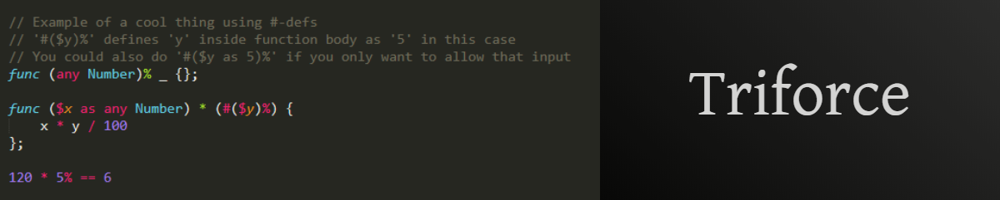

Triforce is a programming language emphasizing performance, power and productivity.

The main goals of the language include:
- a consistent, sensible and well-thought-out language design
- a small, generalised and extensible core language, including support for powerful macro-like functions
- an advanced type system, including dependent types
- the ability to both work on a high level and a lower level close to hardware
- safety by default; less safe options will be discouraged and require opt-in
- readable, understandable code (at least for common situations)
- more things yet to be figured out...

Obviously, some compromises are going to have to be made in order to achieve these goals. The compilation process is probably going to be rather slow, for example.

### A word on the name
The language has recently been renamed from P+ to Triforce, meaning some things are still using the old name or file extension. There are also some (minor?) problems with the name, see issue [#308](https://github.com/TropicSapling/triforce/issues/308).

### Learning the language
I'm currently working on a wiki for this language which will explain some things about the language in a more understandable way than this README does. The wiki is currently very incomplete however, so you can't really learn much from it yet. But it's not really a good idea to start learning this language at this moment anyway, since there's not much stability right now and the latest working compiler is not even able to compile more than a small subset of an old version of the language.

### Syntax highlighting
Currently, there is only syntax highlighting available for Sublime Text 3, which can be found in [the st3 folder.](/st3) If you don't feel like using ST3, you can either try creating your own syntax highlighting for the language, or try using the Swift highlighting (which is, well, better than nothing).

### Some quick info before you start reading the rest
Currently, this README pretty much only consists of a language specification. Similarly to most language specifications, it's rather hard to understand and you'll probably have a hard time learning the language by reading it. It also has the extra perk of not even being written well enough to precisely describe the language! And did I mention that I'm also changing it all the time? Really, the specification is just here for the developers to remember everything. But, you can always attempt to read the rest anyway if you want xD

## Spec
#### Definitions
<sup>Keywords surrounded by</sup>
* <sub>brackets (`[]`) are *optional*</sub>
* <sub>angle brackets (`<>`) **must** be replaced by a name of your choice</sub>
* <sub>backticks (`` ` ``) are **required** and escapes these definitions (i.e. `` {a`|`b} `` means you must literally type `{a|b}`)</sub>
* <sub>braces (`{}`) **and** seperated by bars (`|`) are part of a list of mutually exclusive **required** keywords</sub>
* <sub>brackets (`[]`) **and** seperated by bars (`|`) are part of a list of mutually exclusive *optional* keywords</sub>

<sub>The equivalence symbol (`<=>`) means essentially what it does in mathematics.</sub>
<sub>`<...>` and `[...]` mean something **required** respectively *optional* that fits in.</sub>
<sub>``` \` ``` escapes the escaper (i.e. ``` \`\` ``` means you must literally type ``` `` ```).</sub>

<sub>Everything else is **required.**</sub>

--------

**NOTE:** This specification mainly specifies the built-in parts of the language. See the prelude and libraries for the rest.

--------

### Programs
1. The compiler will evaluate programs as much as it can during compilation, and then convert the remnants into a specified output format.
	- Normally this is machine code
2. Programs are composed as described under "Program composition".

--------

### Program composition
```XML
<program>           = <expr>
<expr>              = [raw] {<air> | {<anon-func>|<named-pattern>} [<expr>] [...] | <applied-named-pattern> | unparsed <expr> | parsed <unparsed-expr>}
<air>               = {[<ws>] | ([<ws>]) | (([<ws>])) | <...>}
<ws>                = <whitespace> [...]
<anon-func>         = [closed|impure|unpredictable] <pattern-def> [...] => <expr>
<pattern-def>       = $(<named-pattern>) as <matcher>
<pattern>           = {<id-token> | <pattern-def>} [...]
<matcher>           = [implicitly] [unparsed] [raw] <match-pattern> [returning <pattern>] [...] [constructed using <pattern>]
<match-pattern>     = {<id-token> | <pattern-def> | ${<pattern>|#<int>} | #(<pattern-def>)} [...]
<int>               = {0|1|2|3|4|5|6|7|8|9}[...]
```

**Note:** An `<expr>` may evaluate at compile time to a valid, say, `<match pattern>`, and would in such a case be a valid `<match pattern>`. See "Anonymous functions" §9. Syntax sugar changes things a bit too; see "Syntax sugar".

--------

### Literals
1. Number structure: `{0|1|2|3|4|5|6|7|8|9}[0|1|2|3|4|5|6|7|8|9|_|.][...]`
	- `.` is a comma used for fractions
	- `_` is a separator used to improve readability
	- ex: `1_234_567.89`
2. Numbers prefixed with `0x` are hexadecimal and additionally allow `a`, `b`, `c`, `d`, `e` and `f`.
	- ex: `0x123456789abc`
3. Numbers prefixed with `0o` are octal and exclude `8` and `9`.
	- ex: `0o1234567`
4. Numbers prefixed with `0b` are binary and only allow `0`, `1` and `_`.
	- ex: `0b00101001_00000110_01010110_10010010`
5. See "Low level" for low level forms of number literals.
6. The symblock `__sb_default_str__` is used for string literals.
	- syntax declared in the prelude: `decl symblock __sb_default_str__ enclosed by " " with escaper \;`
	- `\n`, `\r`, `\t`, `\0` and `\\` inside of a string mean "newline", "carriage return", "tab", "null" and "backslash" respectively

### Anonymous functions
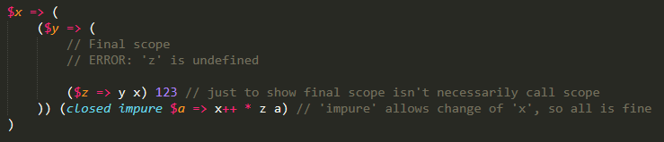

1. Structure: `(<input pars> => <function body>) <input args>`.
2. `<input pars>` = `(<par1>) [(<par2>)] [...]`
3. `<input args>` = `<arg1> [<arg2>] [...]`
4. Every parameter is a *pattern def*.
5. All functions are closures (capturing their original environment).
6. An empty `<function body>` is equivalent to `paused __caller_scope__`.
7. If not enough input args are given, the function is partially applied.
8. Once fully applied, functions reduce to `<function body>` (with all `<input pars>` defined).
	- This is what it means to say that a function returns `<function body>`
9. Functions and patterns can be (partially) called/applied inside of `<function body>`, `<input args>`, `<pattern to define>` and `<pattern to match>`.
	- Note that surrounding backticks (`` \`\` ``) are necessary when applying inside `<pattern to define>`
		- i.e. if we `let f = Something`, then `let f _ = SomethingElse` redefines `f` while `` let `f _` = SomethingElse `` becomes `let Something = SomethingElse`
		- this is because `<pattern to define>` is taken as `implicitly unchecked paused`
		- the surrounding backticks escape all implicits, thereby forcing evaluation even when implicitly `paused`
	- `<pattern to match>` is always fully evaluated, even if it's inside a `paused` block
10. Functions are *pure* and *checked* by default.
	- A pure function has the following properties:
		- its return value is the same for the same input
			- note that the input consists of both the arguments passed and the state of the outer scope
		- its evaluation has no side effects
			- note that debug-mode side effects disappearing in release-mode don't count, allowing i.e. `##[dbg_mode_only] debug <...>` (?)
	- The body of a checked function will be checked by the compiler as soon as it is encountered
		- this means undefined patterns, incorrect syntax, mismatches, etc. are not allowed
11. `impure <function>` allows a function to have side effects.
12. `unpredictable <function>` allows a function to have side effects and different return values for the same input.
	- Mainly useful for functions interacting with the outer world (user input, true randomness, etc.)
13. `unchecked <expr>` allows for an expression (i.e. a function) to be non-checked.
	- This means the compiler won't check the expression until it's in its final scope
	- For an example, see "Example code snippets" §2
14. While functions require at least 1 parameter, `(_ as ()) => <function body>` can be used to emulate a function without parameters.
	- This is also the recommended way; doing `(_ as ...)` or `(_ as _)` serves different (rare) purposes

--------

### Patterns (variables but better)
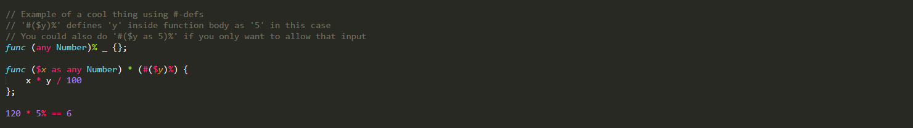

1. `<pattern def>` = `($(<pattern to define>) as <pattern to match> [constructed using <constructor pattern>])` where
	- `<pattern to define>` = ` <dname start>  [{(<pattern def>)|<dname continuation>}] [...] [<dname end>]` where
		- `<dname start>`, `dname continuation`, `<dname end>` are allowed to contain any symbols, including whitespace (TODO: exception for ops)
	- `<pattern to match>`  = `[<mname start>] [{(<pattern def>)|<mname continuation>|${<var>|#<n>}|#<pattern def>}] [...] [<mname end>]` where
		- `<mname start>`, `mname continuation`, `<mname end>` are allowed to contain any symbols, including whitespace (TODO: exception for ops)
		- `$<var>` is either:
			- a name for a parameter that is linked to a parameter of the same name in `<pattern to define>`, or
			- the symbol `_` (specifying to link whatever parameter is left to link)
		- `<n>` is a number specifying what parameter to link to
		- ex: `(($(add (1) and (2) to ($(a) as 3) plus $b) as $#1 $a $#0 $_) => <...>) ($x $y $z $w => x + y + z + w)` where
			- `<...>` = `add 1 and 2 to 3 plus 4` => `($x $y $z $w => x + y + z + w) 2 3 1 4` => `2 + 3 + 1 + 4`
		- if we `let f = $x $y $z => <...>` then `$a as f #_ #_` <=> `$a as f _ _`
			- **note:** this equivalence does not hold for `$a as paused f #_ #_ #_` and `$a as paused f _ _ _`
		- for more info on `#<pattern def>`, see "Example code snippets" §4
	- `<constructor pattern>` is like `<pattern to match>` except `#` is not allowed and it works a bit differently
		- i.e. if `Player $health $max_health` is defined, then `Player 50 100 constructed using $constructor` defines `$constructor` as `Player`
			- `Player 50 100 constructed using Player $a $b` also works, but defines nothing
	- patterns named `_` (written like `($_ as <...>)`) are called unnamed patterns and will not be defined

2. Call structure for ex. def. `$(example pattern taking (_ as _) and (_ as _)) as _`:
	- mixfix ex: `example pattern taking (x) and (123)`
	- prefix ex: `(example pattern taking $_ and $_) x 123`
		- `$_` is here used as an unnamed pattern since `_`

3. Patterns are defined within the scope described by the *pattern parsing algorithm*.

4. Patterns can only be defined within `<input pars>`.
	- If it looks like a pattern is defined outside, it's actually a partially applied pattern

5. Patterns, like functions, can be partially applied.
	- This can be done by leaving out some of the `<input args>` or by having placeholders for args using `$(<placeholder pattern>)`
		- `<placeholder pattern>` has the same syntax as `<pattern to define>`, but doesn't define the pattern
		- Given a defined pattern `$($a f $b $c)`:
			- ex. of leaving out args: `f`, `1 f`, `f 2`, `1 f 2`
			- ex. of having placeholders: `$x f $y $z`, `1 f $y $z`, `$x f 2 $z`, `$x f $y 3`, `1 f $y 3`
			- ex. of both: `1 f $y 3`

6. Patterns only consisting of names are called *variables*.
	- This means variables are a subset of patterns in Triforce
		- Whenever we talk about patterns, we're including variables
	- I.e. `$(example pattern)` is a variable, while `$(example pattern taking $x)` is not

7. Patterns can be placed anywhere functions can as long as they become a function after full evaluation.
	- This means that anywhere it says `<function>` in this README it's actually `<function/pattern-becoming-function>`
	- TODO: check if there are any exceptions to this

--------

### Pattern parsing algorithm
1. Choose a `$(<...>)` and move to its outside.
	- NOTE: If the pattern is after 'as', choose a `#(<...>)` here instead (? TODO)
2. If inside another `$(<...>)`, move to its outside, and then keep leaving scopes until you find `as`.
   If not, keep leaving scopes until you find `=>`.
3. Your pattern is defined after this `as` or `=>`.

--------

### Pattern matching
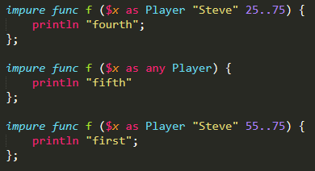

1. When a pattern name is used, the compiler will try to find a matching pattern definition. If it can't find any match, it reports a compile time error.

2. If 2 or more variables in the same function have the same name they will be pattern matched to be equal.
	- i.e. in `$x $y $x => <...>` the 2 `x`s must be equal
	- the equality function `==` is defined using this

3. An and/or-pattern, `a|b|...|z [& <or-pattern>] [...]`, can be used in pattern matching.
	- `a|b|c` <=> `a|a|b|c|b|a` <=> `c|a|b`
	- `a`, `b`, `c`, `a|b`, `a|c` and `a|b|c` all match `a|b|c`
	- `a|b|c`, `a|b` and `a|c` *may* match `a`, `b` or `c` (and `a|b|c` *may* match `a|b`)
		- by default this will compile and instead pattern matching will be completed at runtime; if this fails, the program crashes
		- if using `prerun` this counts as failing to match and won't compile
	- `a|b|c & b|c|d` <=> `b|c`
		- all matching involving and-patterns is done after the and-patterns have collapsed into or-patterns
	- and/or-patterns may contain the "not" (exclusion) operator `~`
		- ex: `a|b|c & ~c` <=> `a|b`
		- ex: `a|b   & ~c` <=> `a|b`
			- **note:** `<or-pattern> & ~Undefined` is *not* equivalent to `<or-pattern>`, see "Pattern matching" §6
	- side-note: and/or-patterns are similar to intersection/union types in other languages
	- or-patterns are *lazy*

4. `...` is used in (and/or-)patterns to let the compiler figure out the rest.
	- ex: `0|1|...` is an or-pattern consisting of all integers >= 0

5. Pattern matching is done at compile time whenever possible. If pattern matching can't be completed during compile time, it will continue during runtime.
	- `prerun` can be used to override this and force pattern matching to be completed during compile time
	-    `run` can be used to override this and force pattern matching to only be done during runtime

6. The special `Undefined` value matches any pattern.
	- i.e. `$x as 123` <=> `$x as Undefined|123`
		- note that while this will compile, if `x` is `Undefined` but still used during runtime the program will crash
	- `$x as Undefined` specifies that `x` must be `Undefined`
		- useful for expressions returning an infinite loop: `forever {<...>}: Undefined`
	- `$x as ~Undefined` overrides this and specifies that `x` must *not* be `Undefined`
		- useful for ensuring something is total: `this_should_be_total: ~Undefined`

--------

### Values
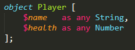

1. Partially applied functions and patterns are treated as values.
	- called *objects* when of the form `<Capitalized Name> [<pars>] ()`
2. There exists a special `Undefined` value, which will be inserted into compilation or-patterns whenever a value might not come to exist during runtime. This happens if:
	- the program specifies it might crash during runtime
		- ex: `let x = rand any Int; if x == 1337 {panic!}; x` returns `Undefined|(any Int)` during compilation
	- the compiler suspects there is an infinite loop in the program
		- ex: `let x: auto = 0; forever {x++}; x` returns `Undefined|1|2|...` during compilation
		- note that due to the halting problem the compiler may think there is an infinite loop when there isn't, hence 'suspects'
	- for more info, see "Example code snippets" §1
3. There are no other values.
	- Numbers, strings, etc. are defined as partially applied functions or patterns
4. Values are differentiated using pattern matching (as described under "Patterns" and "Pattern matching").

--------

### Pseudo-values
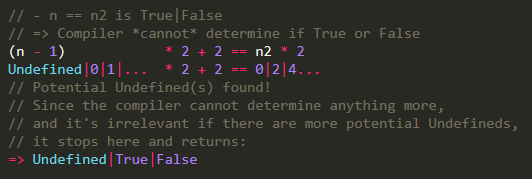

1. Pseudo-values are similar to values but act a bit differently, and include:
	- and/or-patterns
		- ex: `1|2|3 & 2|3|4`
		- values and 1-value ("singleton") and/or-patterns are equivalent
			- ex: `456` is both a value and a 1-value and/or-pattern
	- placeholder-values
		- ex: `$x` (outside of pattern definition)
2. Pseudo-values may be created by the programmer and/or the compiler.
	- programmer ex:
		- or-patterns: `random value in range 0|1|...`
		- placeholder-values: `$n+1`
	- compiler ex:
		- or-patterns: creates an or-pattern for what `(123|456|789) + 1` returns: `124|457|790`
		- placeholder-values: inserts missing placeholder in `+1` by converting to `$n+1`
3. Pseudo-values can be placed anywhere values can (if in the right situation).
4. Pseudo-values only exist before runtime (during compilation).
	- and-patterns collapse into or-patterns during compilation
		- i.e. `1|2|3 & 2|3|4` collapses into `2|3`
		- **note:** `<or-pattern> & ~Undefined` is an exception to this, see "Pattern matching" §6
	- or-patterns (eventually) collapse into single values at runtime
		- i.e. `1|2` collapses into either `1` or `2`
		- programs not allowing this to happen won't be accepted by the compiler (TODO: check if this works, maybe change to runtime crash?)
	- placeholder-values are converted into something else at runtime (TODO: figure out what)
5. And/Or-patterns are further described in "Pattern matching" §3
6. Placeholder-values are further described in "Patterns" §5

--------

### Evaluation
1. Triforce uses eager evaluation.
2. `(<expr>)` returns whatever is left of `<expr>` after evaluation to the outer scope.
3. The compiler will try to run as much as possible during compilation unless otherwise specified.
4. There are 3 stages of evaluation:
	1. Patterns are "expanded"
		- i.e. if we `let f = $x $y => <...>` then `f` is expanded to `f $x $y`
	2. Synonyms are deconstructed (see "Synonyms and Shadows")
	3. Function application is evaluated
5. `paused` prevents evaluation from going past stage 1.

--------

### Equality
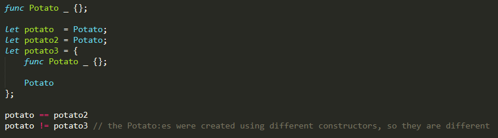

1. 2 finally evaluated values are equal if they refer to the same named function and they have the same applied args.
	- This means anonymous functions are incomparable
	- A value is first finally evaluated when all synonyms have been deconstructed
	- What it means for them to "refer" to the same function is that they are both partial applications of the exact same function
	- See "Example code snippets" §5 for more info
2. 2 placeholder-values are always equal.
	- I.e. `$xyz == $abc`
3. `$x $y => <body>` and `$x => $y => <body>` are always equal.
	- Note that this equality doesn't hold if `$y => <body>` is named though
4. Equality of and-patterns is decided after they have collapsed into or-patterns.
5. Equality of or-patterns is either decided after collapse at runtime, *or* during compilation iff all below criteria are met:
	- They consist of the same values in the same order
	- They were both formed as a result of known-to-be-equal pseudo-values being combined in some way with *known* terms (see "Misc" §8)
6. 2 values being equal and 2 values matching are related but not the same, see "Pattern matching" §2
7. Comparison involving `paused` values will compare the values as if they were strings.
8. See "Example code snippets" §1 for an example of equality.

--------

### Synonyms and Shadows
1. 2 patterns `f $x` and `$y g` are *synonymous* iff we `let f $x = $y g` or the other way around.
	- We say that `f` is *deconstructed* to `g` when evaluated
		- I.e. `f 123` becomes `123 g` (if all patterns match)
		- Deconstruction keeps going on until an atomic pattern is reached
	- If we instead `let f $x = $y => <...>`, then `f $x` gives the anonymous function `$y => <...>` a name
		- We say that `f $x` is *atomic*
2. A newly defined pattern will *shadow* another iff all below criteria are met:
	- They have the same amount of parameters   in the same order
	- They have the same `<pattern to match>`:s in the same order
	- They have the same name

--------

### Symbols
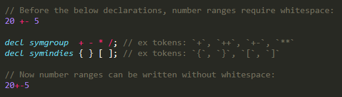

1. Symbols part of the same *symgroup* that are next to eachother form a token.
2. Every *symindie* is its own token.
3. A *symblock* is a block of symbols enclosed by 2 enclosers, forming a token.
4. `decl symgroup  <symbol> [...];` declares a symbol group in the scope.
	- `\s`, `\t` and `\n` can be used as symbols
5. `decl symindies <symbol> [...];` declares one or more symbol independents in the scope.
6. `decl symblock <name> enclosed by <encloser> <encloser> [with escaper <escaper>];` declares a symbol block in the scope.
	- all symbols are allowed for use as enclosers and escapers, but must form one token each
	- `<name>` can also be anything forming one token
	- if the 2 enclosers are different, the symblock is automatically nestable
7. There are 2 built-in symgroups: "default" and "whitespace".
8. There are 2 built-in symindies: `(` and `)`.
9. Symblock tokens without defined behaviour are ignored.
	- define their behaviour using `func <symblock name> (implicitly unchecked paused) {<...>};`
10. Tokens formed with the use of symgroups or symindies without defined behaviour will cause an error.

--------

### Low level
1. `<n>{i|u}{8|16|32|64|128|size}` is the syntax for low level integers.
	- `i` = normal/signed int, `u` = unsigned
	- the numbers after `{i|u}` specify the bit-size
		- `size` means pointer-size (usually 32- or 64-bit)
		- see [this discussion](https://www.reddit.com/r/ProgrammingLanguages/comments/h0ar7n/which_names_would_you_use_for_your_sized_numeric/ftl849u/?utm_source=reddit&utm_medium=web2x&context=3) on why we use bits rather than bytes
	- ex: `1_234_567u32`
	- ex: `987_654_321isize`
2. `<n>f[loat]{32|64}` is the syntax for low level floating point numbers.
	- the numbers after `f[loat]` specify the bit-size
	- ex: `1234.567f64`
	- ex: `0x12float32`
		- `0x12f32` is instead a valid hexadecimal *integer*
3. Arithmetic operators are overloaded with built-in low level operations for low level numbers.
	- i.e. `123isize + 456isize` is the low-level add operation, while `123 + 456` may be defined to be something else
4. `-><x>` is a pointer to `<x>` (the address of `<x>`)
	- a pointer is just a low level integer, but usually written in hex form (i.e. `0x123456789abc`)
5. `{1|2|4|8|16|size}@<addr>` gets data of the specified byte-size located at `<addr>`.
	- we use bytes rather than bits here to make dereferencing easier
		- makes it easier because pointer arithmetic uses bytes
	- there will also be a higher level `@<ptr>` version in the future
6. `__push_stack__ <x>` pushes `<x>` to the stack.
	- TODO: do we need this? or is asm support enough?
7. `__pop_stack__ <x>` pops from the stack into `<x>`.
	- TODO: do we need this? or is asm support enough?
8. `__asm__ (<assembly code block>)` allows you to write inline assembly.

--------

### Syntax sugar
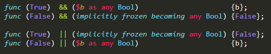

1. `$(<pattern to define>)` <=> `($(<pattern to define>) as _)` <=> `($(<pattern to define>) as $#0 [$#1] [...])`
	- If the pattern is a variable, this allows the input to be any kind of function, which you can call like `<defined pattern> [<arg1>] [<arg2>] [...]`
	- If the pattern isn't a variable, the amount of `$` after `as` will match the amount of parameters of the pattern
		- i.e. `$(pattern taking $x and $y)` <=> `($(pattern taking $x and $y) as $#0 $#1)`

2. `(<named pattern>)` <=> `($_ as <named pattern>)` <=> `(_ as <named pattern>)`
	- Note that `$_` and `_` are not generally equivalent; this is a special case
	- Allows for `() => <function body>` (becoming `(_ as ()) => <function body>`)

3. `$(<variable to define>) as <pattern to match>` <=> `$(<variable to define> _ [...]) as <pattern to match>`
	- i.e. `$b as Bool _` <=> `$(b _) as Bool _`

4. `__caller_scope__` can be used to avoid making your program look like Lisp:
	- `(<input pars> => __caller_scope__) <input args> <rest of scope>` <=> `(<input pars> ($__caller_scope__ as paused) => __caller_scope__) <input args> (<rest of scope>)`
	- Note that this should be used sparingly, and that the function evaluating `__caller_scope__` must be marked as `unpredictable`
		- unless you're just returning `paused __caller_scope__`, in which case it's equivalent to returning nothing and doesn't need to be marked

5. `$(<pattern to define>) as implicitly paused [<pattern to match>] [becoming <pattern to match>]` can be used to delay evaluation of input until inside the scope where the pattern is defined:
	- `(($x as implicitly paused 1 becoming 2) => x) <expr>` <=> `(($x as paused 1) => x: 2) (paused <expr>)`
	- `$<...> as implicitly paused [becoming <...>]`         <=> `$<...> as implicitly paused _ [becoming <...>]`

6. `decl $(<pattern to declare>) [...];` allows use of declared patterns before they have been defined.
	- Note that they must still be defined somewhere in the scope
	- See "Example code snippets" §3 for an example

7. Exponentiation for fractional numbers: `123.45E-6` <=> `0.00012345`, and `123.45E+6` <=> `123_450_000`.

--------

### Built-in "functions"
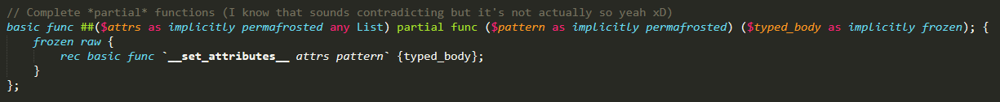

1. `__all_args__ <function>` returns all possible args that can be applied to the function. `length >= 1`.
	- ex: `__all_args__ (f $n $str) == [any Nat, any String]`
		- except array is special: `f [any Nat, any String] == f (any Nat) (any String)`
	- `__all_args_but_one__` does the same except doesn't apply the last arg
		- may be removed in the future in favor of using `__all_args__[..__all_args__.length - 1]`
	- `__all_args_placeholders__` does the equivalent for placeholder args
		- ex: `__all_args_placeholders__ (f $x $y) == [$x, $y]`
2. `__applied_args__ <function>` returns the args that have been applied to the function. `length >= 0`.
3. `__set_attributes__ <attr> <id>` tells the compiler that `<id>` has attribute `<attr>` and returns `<id>`.
	- precedence is specified using attributes
4. `__assign__ <var> <val>` does *unchecked* assignment.
5. `__catch__` is a special function, more info in example 4.
6. `paused <expr>` pauses evaluation of `<expr>` by returning `<expr>` unevaluated.
	- similar to Lisp's `quote`, but is checked (unless you do `unchecked paused`)
	- i.e. assuming `func f() {paused (1 + 2)};`, then `f() * 3` => `(1 + 2) * 3` => `9`
7. `raw <expr>` is identical to `<expr>` except it's unhygienic.
	- i.e. assuming `func f() {paused raw (1 + 2)};`, then `f() * 3` => `1 + 2 * 3` => `7`
	- note: removes *all* all-encompassing parentheses, so even `raw (((((1 + 2)))))` becomes `1 + 2`
		- it does this even for input `as implicitly raw`
8. `listified paused <expr>` converts `<expr>` to an AST in the form of a multi-dimensional list
	- each item in the list is either a token `String` or a list of tokens
	- the form of the AST will be stable once the language is stable
	- note: `listified unchecked paused <expr>` produces an AST with the entire `<expr>` as 1 token
9. `codified <AST>` converts `<AST>` to paused code
10. `codified (listified paused <code>)` <=> `paused <code>`
11. `continue matching [for <function>]` continues pattern matching if possible.
		- if `<function>` isn't specified it will default to the current function
		- if `<function>` is `caller` it will continue matching for the caller
		- if it's not possible to continue, there will be an error
			- note that `__catch__` can be used to prevent this

--------

### Misc
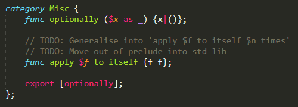

1. `_` is a special built-in symbol meaning different things in different contexts, but typically it means "anything".
2. `(<expr>)` *always* has higher precedence than `<expr>`.
3. Number literals, char literals and string literals are built-in and bound to library implementations similarly to Agda.
4. Precedence can be overriden using `##[precedence (below|above) <function>] <your function>`.
5. Single-line `//` and multi-line `/* */` comments are built-in (to avoid issues with nested strings).
6. `Maximal munch`/`Longest match` parsing is used to solve ambiguity (unless invalid; then context is used).
7. In case there's ambiguity between if a fully applied function or another partially applied function was intended, the compiler will assume the fully applied function was intended and give a warning about this.
    - I.e. `if True then do_something` is assumed to mean the fully applied `if $cond then $body` function rather than a partially applied `if $cond then $expr else $expr`
8. An expression, or term, is said to be *known* to the compiler if the compiler sees it as a specific value rather than a pseudo-value.
9. `caller` is a reserved keyword for the caller of the current function.
10. The file extension for the language is `.tri`.
11. Triforce allows ad-hoc polymorphism; you can create multiple functions with the same name but with different parameters.
	- Meaning function & operator overloading is possible

--------

## Other random stuff
### Example code snippets


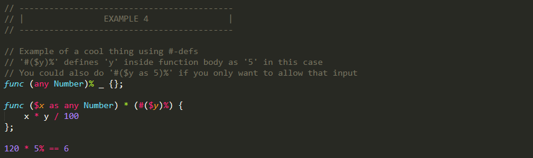


*More examples can be found in [readme_examples.tri](examples/readme_examples.tri). There you can also find the source code for the pictured examples.*

--------

### <s>Data types [OUTDATED]
#### Basic
* `(array|list|pointer)[*<n>]`

#### Extras
* `only [register|stack|heap] [volatile] [unique] [func] (array|list|pointer)[*<n>] [chan]`
* `[register|stack|heap] [const|volatile] [unsigned|signed|fraction] number [func] [(array|list|pointer)[*<n>]] [chan]`
* `only [register|stack|heap] [volatile] [unsigned|signed|fraction] number [func] (array|list|pointer)[*<n>] [chan]`
* `[register|stack|heap] [const|volatile] [unsigned|signed] (int|char) [func] [(array|list|pointer)[*<n>]] [chan]`
* `only [register|stack|heap] [volatile] [unsigned|signed] (int|char) [func] (array|list|pointer)[*<n>] [chan]`

#### Special
* ``type <custom type> extends <type1>[`|`<type2>`|`<type3>...]``
* `clang <type> <function name>([<parameters>]) { <C code> }`

#### Properties
* `` var`<type>` ``
* `` var`<size>` ``
* `` var`<memsize>` ``
* `` var`<alignment>` ``
* `` var`<scope>` `` (default: `1`)
* `` some_fraction`<precision>` `` \[**NOTE:** The precision value is the number of bits for the exponent, **not** the number of decimals\]
* `` pointer_to_list`<length>` `` \[**NOTE:** `` some_list`<`<property>`>` `` will **not** access the property of the whole list, but the properties of each item of the list.\* Use `` ->some_list`<`<property>`>` `` instead. \]
* `` pointer_to_list`<separator>` ``
* `` str`<encoding>` `` (default: `'utf-8'`)
* `` channel`<buffer>` `` (default: `1`)
* `var>bit<`
* You can assign properties at variable creation: ``<type> [`<`<property1>`>`=<property1 value> `<`<property2>`>`=<property2 value>...] var``

<sup>\*This is because `` some_list`<`<property>`>` `` decays into `` pointer_to_list[>>>]`<`<property>`>` ``</sup>

--------

### Operators [OUTDATED]
#### Arithmetic
* `**`

#### Bitwise
* `&`
* `|`
* `~`
* `^`
* `<<`
* `>>`

#### Compound Assignment
* `&=`
* `|=`
* `^=`
* `<<=`
* `>>=`

#### Misc.
* `@`
* `>>>`
* `<<<`
* `in` (example: `if(item in arr) ...`)

--------

### Lists & arrays [OUTDATED]
* `str[>>>] == "Test"`
* `str[start >>> stop]`
* `str == address`
* `str[when <condition> >>> until <condition>]`
* `pointer sublist -> some_list[start >>> stop]`
* `pointer sublist2 -> some_list[when <condition> >>> until <condition>]`
* `pointer new_sublist -> [1, 2, 3]`
* `pointer new_subarr -> {1, 2, 3}`
* `str[<<<] == "tseT"`
* `str[stop <<< start]`

--------

### Conditionals [OUTDATED]
* `match <var> { case <val1>: <code> [case <val2>: <code>...] [default: <code>] }` (equivalent of C's `switch`)

--------

### Strings [OUTDATED]
* `"null terminated string"`
* `'string size determined by <size> property'`
* `'null terminated string, but <size> property can still be used to get size\0'`
* `"null terminated string" == 'null terminated string\0'`

--------

### Functions [OUTDATED]
* `return [from <function>] <value>` (**NOTE:** You can't return from just any function, it needs to call the function you're currently in either directly or indirectly)

--------

### Loops [OUTDATED]
* `repeat <n times> { <code> }`
* `break [<value>] [from <function>]`

--------

### Concurrency [OUTDATED]
* `async { <code> }`
* `select { <cases> }`
* `send <data> to <channel>`
* `<type> <var> = receive from <channel>`

--------

### Built-in global variables [OUTDATED]
* `__OS`
* `__path`
* `__args`
* `__argc`
* `__line`
* `__item`
* `__app`

--------

### <s>Precedence [OUTDATED]
1. `()`, `[]`, `.`, `++`, `--`
2. `!`, `~`, `(<type>)`, `@`, `->`, `**`
3. `*`, `/`, `%`
4. `+`, `-`
5. `>>`, `<<`
6. `<`, `<=`, `>`, `>=`
7. `==`, `!=`
8. `&`
9. `^`
10. `|`
11. `&&`
12. `||`
13. `=`, `+=`, `-=`, `*=`, `/=`, `%=`, `**=`, `>>=`, `<<=`, `&=`, `^=`, `|=`
14. `>>>`, `<<<`, `,`, `in`

--------
</s>
