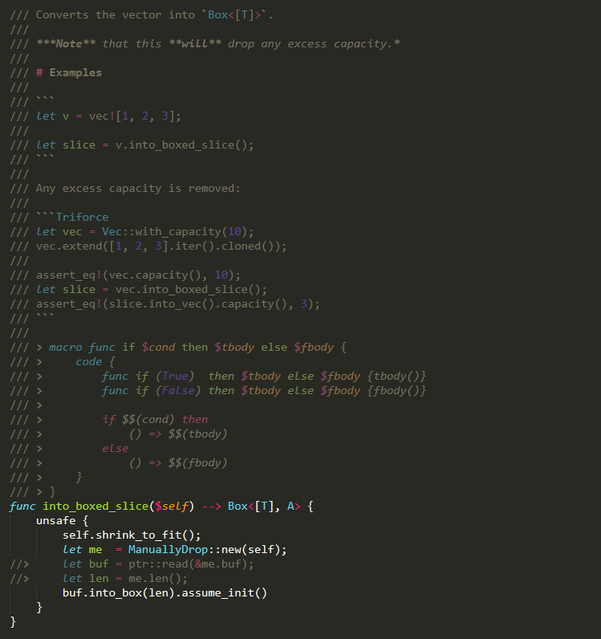

# Syntax highlighting for Sublime Text 4

This folder contains files for highlighting Triforce files in ST4 (along with some useful keyboard shortcuts, etc.).

## Installation instructions
### Windows
1. Download all of the files in this folder.
2. Move them all into `%appdata%\Sublime Text 4\Packages`.
3. Close and reopen ST4, your open Triforce files, etc. if necessary.

### Linux
1. Download all of the files in this folder.
2. Move them all into the correct folder (probably `~/.config/sublime-text-4/Packages`).
3. Close and reopen ST4, your open Triforce files, etc. if necessary.
